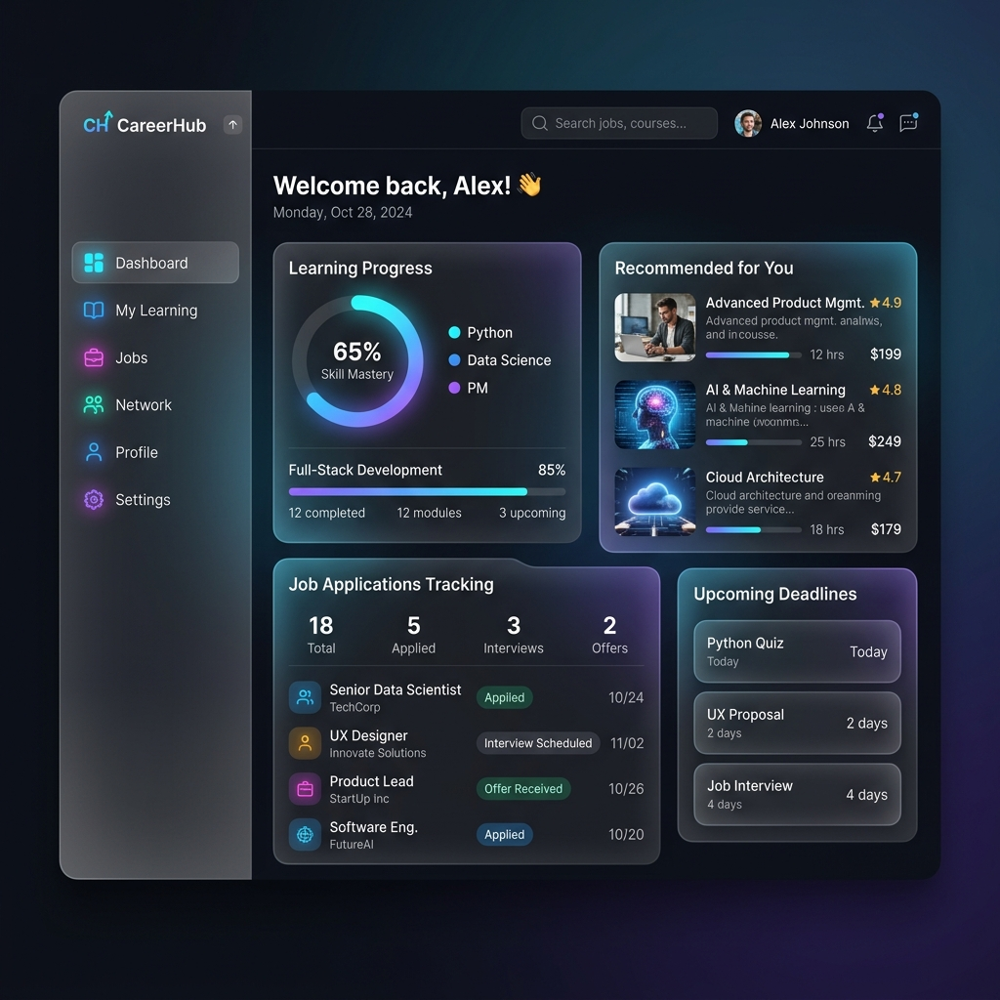
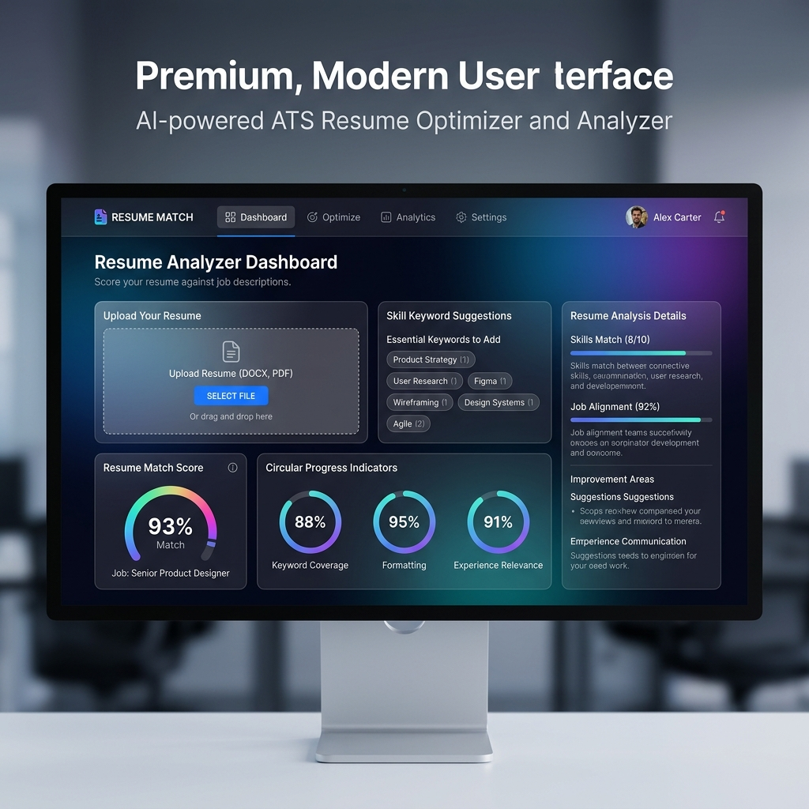
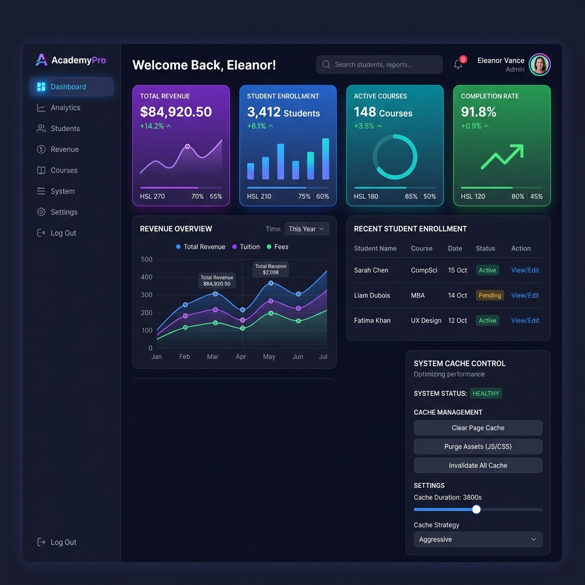

# 🎓 CareerHub - Learn, Upskill, Apply, Get Hired

CareerHub is a premium, state-of-the-art career development and interactive learning portal. It provides students with course catalogs, interactive video curriculum panels, certifications, job postings with application trackers, and a built-in ATS resume optimizer. It also features a robust Admin Control Center for course creation, payment verification, student management, and site-wide analytics.

---

## 📸 Platform Previews

### 1. Student Dashboard & Learning Portal
A modern, dark-mode dashboard showcasing learning progress, active applications, and saved jobs.


### 2. ATS Resume Optimizer
An advanced module helping students evaluate their resume match score and identify missing keywords.


### 3. Admin Control Center
A data-rich command center for managing course catalogs, reviewing payments, and tracking user lists.


---

## 🚀 Key Features & Functionality

### 🧑‍🎓 Student Portal
* **Dynamic Student Dashboard**: Displays overview cards (active courses, applications, saved jobs), recent enrollment activities, and upcoming interview tasks.
* **Course Catalog & Interactive Classroom**: Browse course cards with detailed pricing, duration, and structures. The custom classroom interface lets students watch video lessons, check off completed segments, and earn certificates.
* **Job Board & Application Tracker**: Search, filter, and save job opportunities. Apply directly by uploading a PDF resume and track statuses from *Applied* to *Shortlisted* and *Interview Scheduled*.
* **ATS Resume Analyzer**: Upload resume PDFs to evaluate matches against specific roles, with recommendations for keyword additions, styling fixes, and section formatting.
* **Course Checkout**: Enroll in premium courses using a checkout process supporting promo codes, discount calculations, and payment methods.

### 🛡️ Admin Portal
* **System Control Dashboard**: Overview of platform metrics (total students, active courses, total enrollments, and revenue metrics) accompanied by visual distributions.
* **User Management**: View comprehensive student profiles, view sign-up dates, and remove inactive accounts.
* **Transaction Auditor**: Audit student orders and update payment statuses (e.g. pending, completed) or verify payment amounts.
* **Course Creator & Module Structurer**: Create new courses, upload lessons, structure chapters, select pricing tier, and manage publishing options.
* **Admin Inbox & Settings**: Read and manage incoming student messages.

---

## 🛠️ Technology Stack

CareerHub uses a modern, clean, and robust architecture:

### 💻 Frontend
* **React 19**: Modern component lifecycle, hooks, and React context API for fast component render times.
* **Vite 8**: Fast client environment configuration and lightning-quick Hot Module Replacement (HMR).
* **Vanilla CSS**: Clean, responsive layout stylesheets using CSS Grid, Flexbox, custom design tokens, smooth hover micro-animations, and glassmorphism elements.
* **Axios**: Promised-based HTTP client managing API configurations and auth interceptors (JWT tokens).
* **React Router Dom 7**: Dynamic client routing, route guards, and nested layouts.

### 🔌 Backend & Database
* **Node.js & Express.js**: Fast, lightweight routing middleware and controllers.
* **MongoDB & Mongoose**: Flexible document structure and ORM schema designs.
* **MongoDB Memory Server**: Integrates a virtual, standalone database fallback on local server startup. If a local MongoDB service is not running, the backend spins up an in-memory database and seeds it with mockup data automatically for a zero-configuration setup.
* **JWT (JSON Web Tokens)**: Secure token authentication for students and administrators.
* **Bcrypt.js**: Advanced salting and hashing security for stored user credentials.
* **PDF-Parse**: Extract text content from PDF resumes on the server during ATS evaluation.

---

## ⚙️ Quick Start Installation

### Prerequisites
* **Node.js** (v18 or higher recommended)
* **npm** (v9 or higher)

### 1. Clone & Setup Repository
```bash
git clone https://github.com/shaikafridd/internship-project.git
cd internship-project
```

### 2. Configure Backend Env
Create a `.env` file in the `backend` directory:
```env
PORT=5000
MONGODB_URI=mongodb://127.0.0.1:27017/auth-backend
JWT_SECRET=your_secret_key_here
JWT_EXPIRES_IN=30d
```
*(Note: If local MongoDB is not running, the backend will automatically fall back to an in-memory mock database and seed it with demo data!)*

### 3. Run Backend Server
```bash
cd backend
npm install
npm run dev
```

### 4. Run Frontend Server
```bash
cd ../frontend
npm install
npm run dev
```

### 5. Access the Web Application
Open your browser and navigate to:
* **Frontend Site**: [http://localhost:5173/](http://localhost:5173/)
* **Backend API Check**: [http://localhost:5000/](http://localhost:5000/)

### 🔑 Test Credentials
* **Student Account**: `arshadkhan@gmail.com` (password: `password123`)
* **Admin Account**: `admin` (password: `admin`)
